# ApparelLab 🧪

A full-stack print-on-demand platform where creators design custom apparel, publish listings, and sell directly to customers — powered by AI artwork generation and Cloudinary-based mockup rendering.

---

## ✨ Features

- **Design Editor** — Fabric.js canvas with custom controls (move, scale, rotate, delete) placed exactly over a product's printable area
- **AI Artwork Generation** — Generate artwork from a text prompt using Hugging Face Inference API, placed directly onto the canvas
- **Preset Artworks** — 10 built-in artwork presets ready to drag onto any product
- **Text Tool** — Add and style text (font, bold, italic, underline, color) directly on the canvas
- **Live Preview** — Instantly merge artwork + mockup image in-browser before publishing
- **Color Variants** — Products support multiple color variants, each with its own mockup image
- **Listing System** — Creators publish listings with title, description, and custom selling price (above a base price floor)
- **Mockup Generation** — Cloudinary image transformation composites artwork onto product mockup server-side, at any resolution
- **Payments** — Stripe Checkout for order placement, with webhook-based order fulfillment
- **Auth** — Email/password and Google OAuth via Better Auth (JWT-based sessions)
- **Orders Dashboard** — Creators and buyers can track their orders

---

## 🏗️ Architecture


## 🗂️ Project Structure

```
apparellab/
├── client/                        # React frontend (Vite)
│   └── src/
│       ├── assets/artworks/       # 10 preset artwork PNGs
│       ├── components/ui/         # shadcn/ui component library
│       ├── context/
│       │   └── canvas-context.tsx # Global canvas + listing state
│       ├── lib/
│       │   ├── api.ts             # Axios API calls
│       │   └── canvas-controls.ts # Custom Fabric.js controls
│       └── pages/
│           ├── home/              # Catalog + listings browse
│           ├── design/
│           │   ├── canvas-editor.tsx    # Fabric.js canvas + preview
│           │   └── editor-sidebar.tsx   # Tools: artwork, text, colors, publish
│           ├── listings/          # Public listing page + checkout
│           └── orders/            # Order history
│
└── backend/                       # Express + TypeScript API
    └── src/
        ├── config/                # Cloudinary, DB, Stripe, env
        ├── controllers/           # listing, product, order
        ├── lib/
        │   └── auth.ts            # Better Auth setup
        ├── models/
        │   ├── listing.model.ts   # Listing + artworkPlacement schema
        │   ├── products.model.ts  # Product + printableArea schema
        │   ├── product-color.model.ts
        │   └── order.model.ts
        ├── services/
        │   ├── listing.service.ts # Core: create listing, mockup generation
        │   └── order.service.ts   # Stripe session creation
        ├── webhooks/
        │   └── stripe.webhook.ts  # Order fulfillment on payment success
        └── script/
            ├── seed-product.ts    # Seed apparel templates
            └── seed-template-color.ts
```

---

## 🛠️ Tech Stack

| Layer | Technology |
|---|---|
| Frontend | React 18, Vite, TypeScript, TailwindCSS |
| UI Components | shadcn/ui |
| Canvas | Fabric.js |
| State | React Context + TanStack Query |
| Routing | React Router v6 |
| Backend | Node.js, Express, TypeScript |
| Auth | Better Auth (email/password + Google OAuth) |
| Database | MongoDB Atlas (Mongoose) |
| Storage | Cloudinary (artwork upload + mockup transforms) |
| AI Generation | Hugging Face Inference API |
| Payments | Stripe Checkout + Webhooks |

### Prerequisites

- Node.js 18+
- MongoDB Atlas account
- Cloudinary account
- Stripe account (test mode is fine)


## 📦 Key API Endpoints

| Method | Endpoint | Description |
|---|---|---|
| `POST` | `/api/auth/sign-up` | Register with email/password |
| `POST` | `/api/auth/sign-in/google` | Google OAuth |
| `GET` | `/api/product/templates` | List all product templates |
| `GET` | `/api/product/template/:id` | Single template + colors |
| `POST` | `/api/listing` | Create a new listing |
| `GET` | `/api/listing` | Get creator's listings |
| `GET` | `/api/listing/:slug` | Public listing detail |
| `GET` | `/api/listing/mockup/:slug/:color.jpg` | Generated mockup image |
| `POST` | `/api/order/checkout` | Create Stripe checkout session |
| `POST` | `/api/webhook/stripe` | Stripe payment webhook |

## 📄 License

MIT